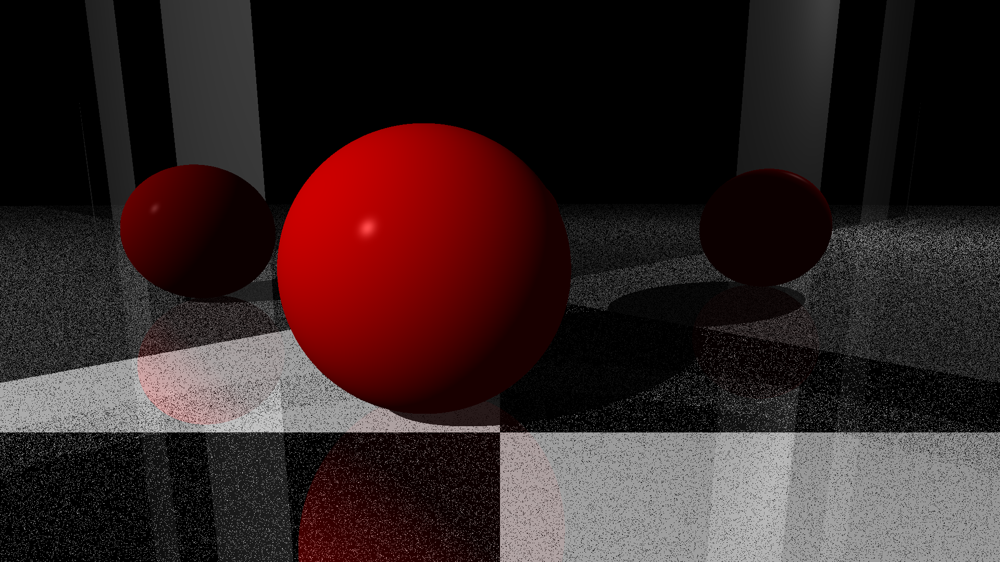

# Raytracer

This is a collection of tools for raytracing in C++ made following
[The Raytracer Challenge](https://pragprog.com/book/jbtracer/the-ray-tracer-challenge)
by Jamis Buck.

This project requires C++17 and CMake 3.12.

## Compile the library

```
sh$ mkdir build
sh$ cd build
sh$ cmake ..
sh$ make
```

## Launch the testsuite

The testsuite uses the GoogleTest suite.

```
sh$ mkdir build
sh$ cd build
sh$ cmake .. -DCMAKE_BUILD_TYPE=Debug
sh$ make check
sh$ ./check
```

## Current state

Currently, I am working on the duo reflection / refraction.



This image was made with the PlaneWorld binary.
